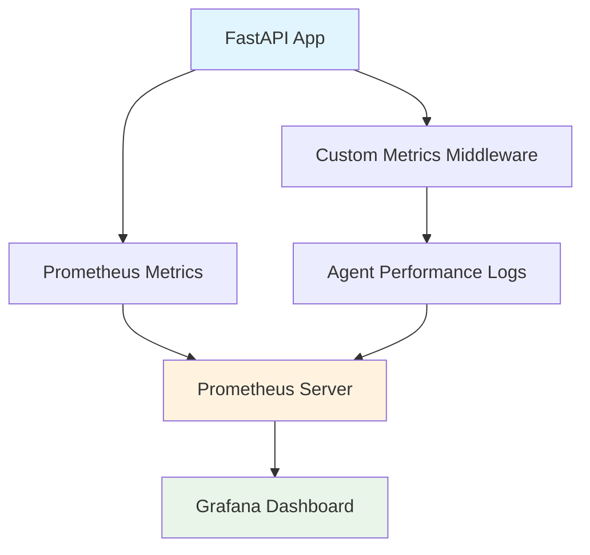

# Future Implementation: Monitoring & Advanced Features

This document outlines planned enhancements for the Smart Document Q&A System, focusing on monitoring, evaluation, and advanced learning capabilities.

## 1. Monitoring & Evaluation with Prometheus + Grafana

### Overview
Implement comprehensive monitoring to track system performance, response quality, and user engagement patterns using industry-standard tools.

### Architecture



### Implementation Steps

#### Step 1: Add Prometheus Client
```bash
pip install prometheus-client
```

#### Step 2: Metrics Collection Service
```python
# services/metrics_service.py
from prometheus_client import Counter, Histogram, Gauge, generate_latest
import time

class MetricsService:
    def __init__(self):
        # Response metrics
        self.response_time = Histogram('qa_response_time_seconds', 'Time spent processing queries')
        self.total_queries = Counter('qa_total_queries', 'Total number of queries processed')
        self.agent_performance = Histogram('agent_step_duration_seconds', 'Time per agent step', ['agent_name'])
        
        # Quality metrics
        self.sources_used = Histogram('qa_sources_per_response', 'Number of sources used per response')
        self.follow_up_rate = Gauge('qa_follow_up_rate', 'Rate of follow-up questions (quality indicator)')
        
        # Search metrics
        self.search_strategy_usage = Counter('search_strategy_usage', 'Usage count per strategy', ['strategy'])
        self.document_retrieval_count = Histogram('documents_retrieved_per_query', 'Documents retrieved per query')
```

#### Step 3: FastAPI Middleware Integration
```python
# main.py additions
from prometheus_client import generate_latest, CONTENT_TYPE_LATEST
import time

@app.middleware("http")
async def metrics_middleware(request: Request, call_next):
    start_time = time.time()
    response = await call_next(request)
    
    # Track response time
    process_time = time.time() - start_time
    metrics_service.response_time.observe(process_time)
    
    if request.url.path == "/ask":
        metrics_service.total_queries.inc()
    
    return response

@app.get("/metrics")
async def get_metrics():
    return Response(generate_latest(), media_type=CONTENT_TYPE_LATEST)
```

#### Step 4: Agent Performance Tracking
```python
# services/agent_service.py additions
async def query_analyzer_agent(self, state: AgentState) -> AgentState:
    start_time = time.time()
    
    # ... existing logic ...
    
    # Track agent performance
    duration = time.time() - start_time
    self.metrics.agent_performance.labels(agent_name="query_analyzer").observe(duration)
    
    return state
```

### Docker Compose Setup

```yaml
# docker-compose.monitoring.yml
version: '3.8'
services:
  prometheus:
    image: prom/prometheus:latest
    ports:
      - "9090:9090"
    volumes:
      - ./monitoring/prometheus.yml:/etc/prometheus/prometheus.yml
    command:
      - '--config.file=/etc/prometheus/prometheus.yml'
      - '--storage.tsdb.path=/prometheus'

  grafana:
    image: grafana/grafana:latest
    ports:
      - "3000:3000"
    environment:
      - GF_SECURITY_ADMIN_PASSWORD=admin
    volumes:
      - grafana-storage:/var/lib/grafana
      - ./monitoring/grafana/dashboards:/etc/grafana/provisioning/dashboards
      - ./monitoring/grafana/datasources:/etc/grafana/provisioning/datasources

volumes:
  grafana-storage:
```

### Prometheus Configuration
```yaml
# monitoring/prometheus.yml
global:
  scrape_interval: 15s

scrape_configs:
  - job_name: 'smart-document-qa'
    static_configs:
      - targets: ['host.docker.internal:8000']
    metrics_path: '/metrics'
    scrape_interval: 5s
```

### Key Metrics to Track

#### Performance Metrics
- **Response Time**: Total time from query to answer
- **Agent Step Duration**: Time spent in each agent
- **Memory Operations**: Time for conversation retrieval/storage
- **Search Performance**: Document retrieval time

#### Quality Metrics
- **Sources per Response**: Number of documents used
- **Follow-up Rate**: Indicator of answer quality
- **Search Strategy Success**: Which strategies work best
- **Session Length**: User engagement indicator

#### System Metrics
- **Query Volume**: Requests per minute/hour
- **Error Rate**: Failed requests percentage
- **Memory Usage**: Conversation storage growth
- **Document Index Size**: Knowledge base growth

### Grafana Dashboard Panels

#### 1. System Overview
- Total queries processed
- Average response time
- Current active sessions
- Error rate trends

#### 2. Agent Performance
- Individual agent execution times
- Agent workflow success rates
- Search strategy effectiveness
- Document retrieval patterns

#### 3. Quality Metrics
- Average sources per response
- Follow-up question rates
- User session durations
- Most queried topics

#### 4. Resource Utilization
- Memory usage trends
- Typesense performance
- API endpoint latencies
- Database query times

### Monitoring Benefits
- **Performance Optimization**: Identify bottlenecks in agent workflow
- **Quality Assurance**: Track answer quality trends
- **Capacity Planning**: Monitor resource usage and scaling needs
- **User Experience**: Understand usage patterns and pain points

## 5. Monitoring Alerts

### Critical Alerts
- Response time > 10 seconds
- Error rate > 5%
- Memory usage > 80%
- Agent failure rate > 2%

### Warning Alerts
- Response time > 5 seconds
- Follow-up rate > 30%
- Search strategy failure > 10%
- Session timeout rate > 15%

This monitoring and learning infrastructure will transform the Smart Document Q&A System into a self-improving, observable, and highly optimized solution.
## Long-Term Memory System Integration

Integrate an advanced long-term memory system to provide persistent, searchable memory capabilities across sessions.

**Repository:** https://github.com/Devparihar5/llm-long-term-memory

### Key Benefits for Document Q&A System

- **Cross-Session Context**: Remember user preferences, document insights, and conversation history
- **Intelligent Memory Extraction**: Automatically extract and categorize important facts from conversations
- **Semantic Memory Search**: Vector-based similarity search for relevant past interactions
- **User Personalization**: Learn user query patterns and preferred response styles
- **Document Relationship Memory**: Remember connections between different documents and topics

### Integration Points

- Enhance existing session management with persistent memory storage
- Combine with current Typesense storage for comprehensive context retrieval
- Integrate memory-aware responses in the Answer Synthesis Agent
- Add memory analytics to track user engagement and document usage patterns

### User Profiling Capabilities

- **Query Pattern Analysis**: Track and remember user question types, complexity preferences, and domain interests
- **Response Style Adaptation**: Learn and store preferred answer formats (detailed vs. concise, technical vs. simplified)
- **Document Usage Tracking**: Monitor and remember which documents users interact with most frequently
- **Interaction Behavior Memory**: Store conversation flow preferences and follow-up question patterns
- **Adaptive Context Engineering**: Adjust context window management based on stored user information consumption patterns
