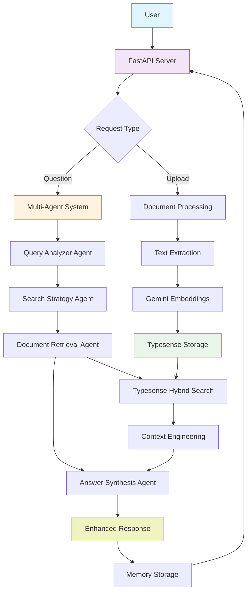

# Multi-Agent-Document-QA

A production-ready document Q&A system using **cooperating AI agents**, Gemini AI, LangGraph orchestration, and Typesense hybrid search with persistent memory and intelligent context engineering.

## Features

- **Multi-Agent System**: 4 specialized AI agents working together using LangGraph
- **Document Upload**: Support for PDF, DOCX, and text files
- **Hybrid Search**: Combines semantic (vector) and keyword search using Typesense
- **Intelligent Context Engineering**: Token-aware context management and optimization
- **Persistent Memory**: Conversation history stored in Typesense for scalability
- **Session Management**: Multi-user support with session-based conversations
- **Agent Transparency**: Detailed processing steps and agent analysis in responses

## Agent Architecture

### Cooperating AI Agents
1. **Query Analyzer Agent**: Analyzes user intent, extracts key concepts, determines query complexity
2. **Search Strategy Agent**: Chooses optimal search approach based on query analysis
3. **Document Retrieval Agent**: Executes searches using determined strategy
4. **Answer Synthesis Agent**: Combines information and generates comprehensive responses

### Agent Workflow
```
Query → Analyzer → Strategy → Retrieval → Synthesis → Response
```

## Setup (for dev)

1. **Install Dependencies**
```bash
pip install -r requirements.txt
```

2. **Start Typesense**
```bash
docker compose up typesense -d
```

3. **Environment Configuration**
```bash
cp .env.example .env
# Edit .env with your Gemini API key
```

4. **Run Application**
```bash
python main.py
```

### Docker Options (for deployment )

#### **Option 1: Build Docker Image First**
```bash
# Build the image
docker build -t smart-document-qa .

# Then run it
docker run -p 8000:8000 --env-file .env smart-document-qa
```

#### **Option 2: Use Docker Compose (Recommended)**
```bash
# Start both Typesense and the app together
docker compose up --build
```

**Recommended:** Use `docker compose up --build` for the easiest setup!

## API Endpoints

- `POST /upload` - Upload documents
- `POST /ask` - Ask questions about documents (returns enhanced response with agent analysis)
- `GET /sessions/{session_id}/history` - Get conversation history
- `DELETE /sessions/{session_id}` - Clear session

## Enhanced Response Format

The `/ask` endpoint now returns detailed agent analysis:

```json
{
  "answer": "Comprehensive answer based on retrieved documents",
  "session_id": "user123",
  "processing_steps": ["query_analyzed", "strategy_determined", "documents_retrieved", "answer_synthesized"],
  "agent_analysis": {
    "intent": "definition",
    "key_concepts": ["artificial intelligence", "machine learning"],
    "search_strategy": "semantic_focused"
  }
}
```

## Usage Example

```python
import requests

# Upload document
files = {'file': open('document.pdf', 'rb')}
response = requests.post('http://localhost:8000/upload', files=files)

# Ask question with enhanced response
question_data = {
    "question": "What is the main topic of the document?",
    "session_id": "user123"
}
response = requests.post('http://localhost:8000/ask', json=question_data)
result = response.json()

print(f"Answer: {result['answer']}")
print(f"Agent Analysis: {result['agent_analysis']}")
print(f"Processing Steps: {result['processing_steps']}")
```

## Architecture



### Technology Stack

- **FastAPI**: REST API framework
- **LangGraph**: Multi-agent orchestration and workflow management
- **Gemini 2.5 Flash**: LLM for intelligent reasoning and response generation
- **Gemini Embeddings**: Vector embeddings for semantic search
- **Typesense**: Hybrid search engine and persistent memory storage
- **Context Engineering**: Intelligent token management and optimization

### Key Capabilities

- **Intelligent Query Analysis**: Understands user intent and query complexity
- **Adaptive Search Strategies**: Chooses optimal search approach per query type
- **Context-Aware Responses**: Maintains conversation context across multiple turns
- **Scalable Memory**: Persistent storage that survives application restarts
- **Production Ready**: Comprehensive error handling and clean architecture

## Future Enhancements

See [FUTURE_IMPLEMENTATION.md](FUTURE_IMPLEMENTATION.md) for planned monitoring, evaluation, and advanced learning features including:
